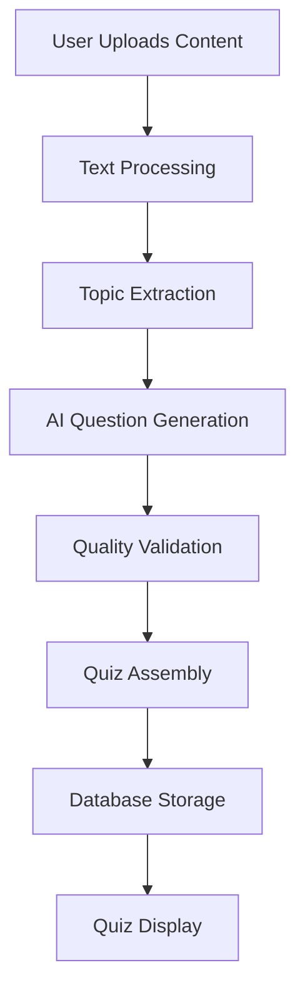
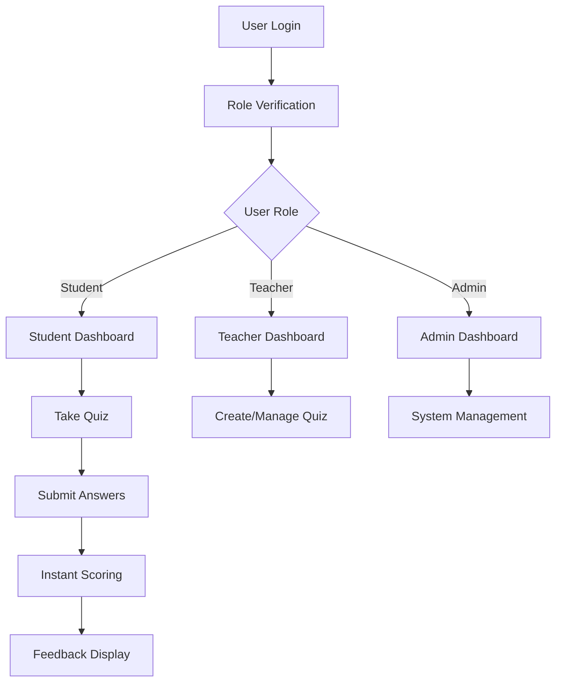
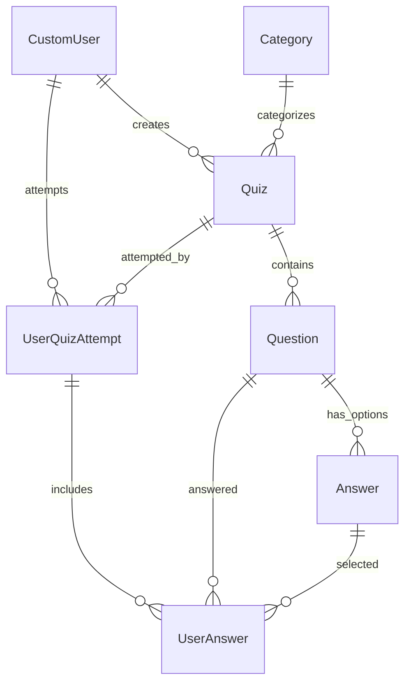
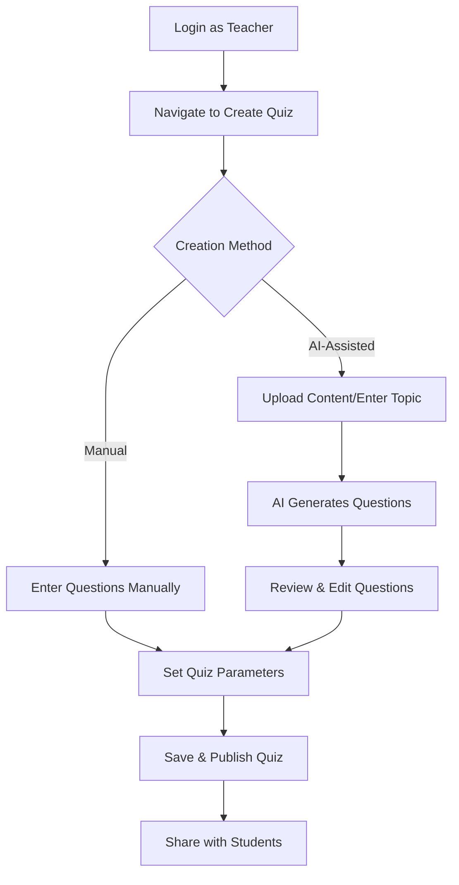
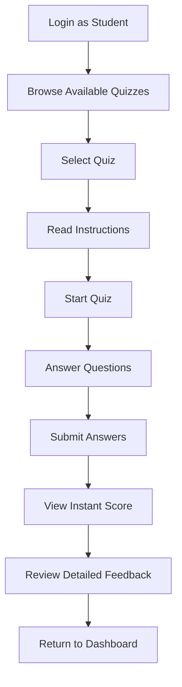

# QuizHub: AI-Powered Quiz Generator - Comprehensive Documentation

*Last Updated: July 14, 2025*  
*Project Owner: Sajid Kalam*  
*Repository: [AI-Powered_Quiz_Generator](https://github.com/SajidKalam-byte/AI-Powered_Quiz_Generator)*

---

## 📋 Table of Contents

1. [Project Motto & Vision](#project-motto--vision)
2. [Executive Summary](#executive-summary)
3. [Project Requirements Compliance](#project-requirements-compliance)
4. [System Architecture](#system-architecture)
5. [Technology Stack](#technology-stack)
6. [API Keys & Configuration](#api-keys--configuration)
7. [Core Features & Functionality](#core-features--functionality)
8. [Data Flow & Processing](#data-flow--processing)
9. [User Roles & Authentication](#user-roles--authentication)
10. [AI Integration Details](#ai-integration-details)
11. [Database Design](#database-design)
12. [Installation & Setup Guide](#installation--setup-guide)
13. [Usage Workflow](#usage-workflow)
14. [Security Considerations](#security-considerations)
15. [Performance & Scalability](#performance--scalability)
16. [Testing Strategy](#testing-strategy)
17. [Deployment Guide](#deployment-guide)
18. [Future Roadmap](#future-roadmap)
19. [Troubleshooting & FAQ](#troubleshooting--faq)

---

## 🎯 Project Motto & Vision

**"Empowering Education Through Intelligent Assessment"**

### Core Mission
Transform the traditional quiz creation process by leveraging AI to generate contextual, topic-specific assessments that provide instant feedback and accelerate learning outcomes.

### Vision Statement
To create an intelligent educational platform that democratizes quality assessment creation, making it accessible to educators while providing students with immediate, constructive feedback for continuous improvement.

---

## 📊 Executive Summary

QuizHub is a sophisticated Django-based web application that revolutionizes educational assessment through AI-powered quiz generation. The platform serves multiple user roles (Students, Teachers, Administrators) and provides comprehensive quiz management capabilities from creation to evaluation.

### Key Value Propositions
- **Time Efficiency**: Reduces quiz creation time from hours to minutes
- **Quality Assurance**: AI ensures question clarity and educational value
- **Instant Feedback**: Immediate scoring with detailed explanations
- **Scalability**: Supports multiple topics, difficulty levels, and user roles
- **Accessibility**: Role-based interfaces optimized for different user needs

---

## ✅ Project Requirements Compliance

### Original Requirements Analysis
> "AI-Powered Quiz Generator from Syllabus/Topics that uses Generative AI to automatically create topic-wise quizzes from uploaded syllabus or textual content. It generates multiple-choice questions (MCQs), evaluates responses, and provides instant scoring and feedback."

### Compliance Verification

| Requirement | Implementation Status | Details |
|-------------|----------------------|---------|
| ✅ **AI-Powered Generation** | Fully Implemented | Integrated Google Gemini & OpenAI APIs |
| ✅ **Syllabus/Topic Input** | Fully Implemented | Text upload & topic extraction via `textprocessor` app |
| ✅ **MCQ Generation** | Fully Implemented | Structured MCQ generation with distractors |
| ✅ **Response Evaluation** | Fully Implemented | Automatic scoring with detailed feedback |
| ✅ **Instant Scoring** | Fully Implemented | Real-time score calculation and display |
| ✅ **Quick Assessments** | Fully Implemented | Optimized for rapid quiz creation and taking |
| ✅ **Self-Evaluation** | Fully Implemented | Student dashboard with performance tracking |
| ✅ **Academic Practice** | Fully Implemented | Various difficulty levels and topic categories |

---

## 🏗️ System Architecture

### High-Level Architecture

```
┌─────────────────┐    ┌─────────────────┐    ┌─────────────────┐
│   Frontend      │    │   Django App    │    │   AI Services   │
│   (Templates)   │◄──►│   (Backend)     │◄──►│   (Gemini/GPT)  │
└─────────────────┘    └─────────────────┘    └─────────────────┘
         │                       │                       │
         ▼                       ▼                       ▼
┌─────────────────┐    ┌─────────────────┐    ┌─────────────────┐
│   Static Files  │    │   SQLite DB     │    │   Cache Layer   │
│   (CSS/JS)      │    │   (Data)        │    │   (Redis/Mem)   │
└─────────────────┘    └─────────────────┘    └─────────────────┘
```

### Component Architecture

```
QuizHub Application
├── Presentation Layer (Django Templates + Bootstrap)
├── Application Layer (Django Views & Controllers)
├── Business Logic Layer (AI Services, Quiz Logic)
├── Data Access Layer (Django ORM)
└── External Services (AI APIs, File Storage)
```

---

## 🛠️ Technology Stack

### Backend Technologies
| Component | Technology | Version | Purpose |
|-----------|------------|---------|---------|
| **Framework** | Django | 5.2.4 | Web application framework |
| **Language** | Python | 3.11+ | Primary development language |
| **Database** | SQLite | Default | Development database |
| **API Framework** | Django REST | 3.16.0 | REST API endpoints |
| **Authentication** | Django Auth | Built-in | User management |

### AI & ML Technologies
| Component | Technology | Purpose |
|-----------|------------|---------|
| **Primary AI** | Google Gemini | Quiz generation, content analysis |
| **Fallback AI** | OpenAI GPT-4 | Backup quiz generation |
| **Text Processing** | Python NLP | Content parsing, topic extraction |
| **Document Processing** | PyPDF2 | PDF content extraction |

### Frontend Technologies
| Component | Technology | Version | Purpose |
|-----------|------------|---------|---------|
| **UI Framework** | Bootstrap | 5.x | Responsive design |
| **Template Engine** | Django Templates | Built-in | Server-side rendering |
| **Styling** | CSS3 | Latest | Custom styling |
| **JavaScript** | Vanilla JS | ES6+ | Interactive functionality |

### Development & Deployment
| Component | Technology | Purpose |
|-----------|------------|---------|
| **Package Manager** | pip | Python package management |
| **Environment** | python-decouple | Configuration management |
| **File Processing** | Pillow | Image processing |
| **HTTP Client** | requests | External API communication |

---

## 🔐 API Keys & Configuration

### Required API Keys

#### 1. Google Gemini API
```ini
# .env file
GEMINI_API_KEY=your_gemini_api_key_here
```

**How to Obtain:**
1. Visit [Google AI Studio](https://aistudio.google.com/)
2. Create/sign in to Google account
3. Generate API key for Gemini model
4. Copy key to environment configuration

**Usage in Code:**
```python
# settings.py
from decouple import config
GEMINI_API_KEY = config('GEMINI_API_KEY')

# ai/utils.py
providers['gemini'] = AIProvider(
    name='Gemini',
    api_key=gemini_key,
    endpoint='https://generativelanguage.googleapis.com/v1beta/models/gemini-2.0-flash:generateContent',
    model='gemini-2.0-flash'
)
```

#### 2. OpenAI API (Fallback)
```ini
# .env file
OPENAI_API_KEY=your_openai_api_key_here
```

**How to Obtain:**
1. Visit [OpenAI Platform](https://platform.openai.com/)
2. Create account and verify
3. Navigate to API Keys section
4. Generate new secret key

#### 3. Django Secret Key
```ini
# .env file
SECRET_KEY=your_django_secret_key_here
```

### Configuration Management

#### Environment Setup
```python
# quizhub/settings.py
import os
from pathlib import Path
from decouple import config

# Security
SECRET_KEY = config('SECRET_KEY', default='django-insecure-fallback')
DEBUG = config('DEBUG', default=True, cast=bool)

# AI Services
GEMINI_API_KEY = config('GEMINI_API_KEY')
OPENAI_API_KEY = config('OPENAI_API_KEY', default='')

# Database
DATABASES = {
    'default': {
        'ENGINE': 'django.db.backends.sqlite3',
        'NAME': BASE_DIR / 'db.sqlite3',
    }
}
```

#### Security Best Practices
- ✅ Never commit API keys to version control
- ✅ Use environment variables for sensitive data
- ✅ Implement key rotation policies
- ✅ Monitor API usage and billing
- ✅ Set up rate limiting for API calls

---

## 🚀 Core Features & Functionality

### 1. AI-Powered Quiz Generation

#### Content Input Methods
- **Text Upload**: Direct text input via web interface
- **File Upload**: Support for .txt, .pdf, .docx files
- **Topic Specification**: Manual topic selection for targeted quizzes

#### Question Generation Process
```python
# Workflow: Content → Topics → Questions → Quiz
def generate_quiz_workflow(content, parameters):
    1. Content Analysis → Extract topics and concepts
    2. Topic Selection → Filter relevant educational content  
    3. Question Generation → Create MCQs with AI
    4. Quality Validation → Ensure question clarity
    5. Quiz Assembly → Structure final quiz format
    return structured_quiz
```

#### AI Prompt Engineering
```python
# Example prompt template for Gemini
prompt = f"""
Generate {num_questions} multiple choice questions about: {topic}

Requirements:
- Difficulty: {difficulty}
- Educational level: {content_analysis.level}
- Clear, unambiguous questions
- 4 options with 1 correct answer
- Plausible distractors

Format as JSON with structure:
{{
    "questions": [
        {{
            "question": "Question text?",
            "options": ["A", "B", "C", "D"],
            "correct_answer": 0,
            "explanation": "Why this is correct...",
            "difficulty": "{difficulty}"
        }}
    ]
}}
"""
```

### 2. Multi-Role User Management

#### Role-Based Access Control
```python
# users/models.py
class CustomUser(AbstractBaseUser, PermissionsMixin):
    ROLE_CHOICES = (
        ('student', 'Student'),
        ('teacher', 'Teacher'), 
        ('admin', 'Admin'),
    )
    role = models.CharField(max_length=10, choices=ROLE_CHOICES)
```

#### Permission Matrix
| Feature | Student | Teacher | Admin |
|---------|---------|---------|-------|
| Take Quizzes | ✅ | ✅ | ✅ |
| View Scores | ✅ (Own) | ✅ (All) | ✅ (All) |
| Create Quizzes | ❌ | ✅ | ✅ |
| Manage Users | ❌ | ❌ | ✅ |
| System Settings | ❌ | ❌ | ✅ |
| Analytics | ❌ | ✅ (Limited) | ✅ (Full) |

### 3. Advanced Quiz Features

#### Quiz Types
- **Regular Quiz**: Standard assessment format
- **Daily Challenge**: Time-limited daily questions
- **Featured Quiz**: Highlighted content
- **AI Generated**: Fully automated creation

#### Difficulty Levels
- **Easy**: Basic concepts, straightforward questions
- **Medium**: Moderate complexity, some analysis required
- **Hard**: Advanced topics, critical thinking needed

#### Scoring System
```python
# Immediate scoring calculation
def calculate_score(user_answers, correct_answers):
    correct_count = sum(1 for ua, ca in zip(user_answers, correct_answers) if ua == ca)
    total_questions = len(correct_answers)
    percentage = (correct_count / total_questions) * 100
    return {
        'score': percentage,
        'correct': correct_count,
        'total': total_questions,
        'grade': assign_grade(percentage)
    }
```

### 4. Instant Feedback System

#### Feedback Components
- **Immediate Score**: Percentage and grade display
- **Answer Analysis**: Question-by-question breakdown
- **Explanation**: AI-generated rationale for correct answers
- **Performance Insights**: Strengths and improvement areas

#### Feedback Generation
```python
# AI-powered explanation generation
def generate_explanation(question, correct_option, user_option):
    prompt = f"""
    Explain why option {correct_option} is correct for: "{question}"
    User selected: {user_option}
    Provide clear, educational explanation.
    """
    return ai_service.generate_explanation(prompt)
```

---

## 📊 Data Flow & Processing

### Quiz Generation Flow



### User Interaction Flow



### AI Processing Pipeline

```python
class AIQuizGenerator:
    def generate_quiz(self, content, parameters):
        # Step 1: Content preprocessing
        processed_content = self.preprocess_content(content)
        
        # Step 2: Topic analysis
        topics = self.extract_topics(processed_content)
        
        # Step 3: Question generation
        try:
            questions = self._generate_with_gemini(topics, parameters)
        except Exception:
            questions = self._generate_with_openai(topics, parameters)
        
        # Step 4: Quality assurance
        validated_questions = self.validate_questions(questions)
        
        # Step 5: Quiz assembly
        quiz = self.assemble_quiz(validated_questions, parameters)
        
        return quiz
```

---

## 👥 User Roles & Authentication

### Authentication System

#### Custom User Model
```python
class CustomUser(AbstractBaseUser, PermissionsMixin):
    username = models.CharField(max_length=150, unique=True)
    email = models.EmailField(blank=True, null=True)
    full_name = models.CharField(max_length=255)
    role = models.CharField(max_length=10, choices=ROLE_CHOICES)
    
    # Student-specific fields
    student_roll_no = models.CharField(max_length=50, blank=True, null=True)
    academic_year = models.CharField(max_length=50, blank=True, null=True)
    
    # Teacher-specific fields  
    teacher_email = models.EmailField(blank=True, null=True, unique=True)
```

#### Registration Process
- **Student Registration**: Roll number-based registration
- **Teacher Registration**: Email-based with verification
- **Admin Creation**: Command-line superuser creation

#### Access Control Decorator
```python
def role_required(allowed_roles):
    def decorator(view_func):
        def wrapper(request, *args, **kwargs):
            if request.user.role not in allowed_roles:
                return HttpResponseForbidden()
            return view_func(request, *args, **kwargs)
        return wrapper
    return decorator

# Usage example
@role_required(['teacher', 'admin'])
def create_quiz_view(request):
    # Only teachers and admins can access
    pass
```

### Role-Specific Features

#### Student Features
- **Quiz Taking**: Access to available quizzes
- **Progress Tracking**: Personal performance history
- **Dashboard**: Overview of attempted quizzes and scores
- **Profile Management**: Update personal information

#### Teacher Features
- **Quiz Creation**: Manual and AI-assisted quiz creation
- **Student Management**: View student performance
- **Content Upload**: Syllabus and topic management
- **Analytics**: Basic performance insights

#### Admin Features
- **User Management**: Create, modify, delete users
- **System Configuration**: Global settings management
- **Advanced Analytics**: Comprehensive reporting
- **Content Moderation**: Review and approve quizzes

---

## 🤖 AI Integration Details

### AI Service Architecture

#### Multi-Provider Support
```python
class EnhancedAIService:
    def __init__(self):
        self.providers = {
            'gemini': GeminiProvider(),
            'openai': OpenAIProvider(),
            'fallback': RuleBasedProvider()
        }
    
    def generate_quiz(self, content, parameters):
        for provider_name in ['gemini', 'openai', 'fallback']:
            try:
                return self.providers[provider_name].generate(content, parameters)
            except Exception as e:
                logger.warning(f"{provider_name} failed: {e}")
                continue
        raise AIServiceError("All providers failed")
```

#### Content Analysis Features
```python
@dataclass
class ContentAnalysis:
    topics: List[str]              # Extracted topics
    key_concepts: List[str]        # Important concepts
    difficulty_level: str          # Easy/Medium/Hard
    readability_score: float       # 0-100 readability
    word_count: int               # Total words
    estimated_reading_time: int    # Minutes to read
    language: str                 # Detected language
    content_type: str             # Academic/Professional/Casual
    summary: str                  # AI-generated summary
```

#### Quality Metrics
```python
@dataclass  
class QuizMetrics:
    question_clarity: float        # 0-1 clarity score
    option_quality: float         # Distractor effectiveness
    difficulty_consistency: float # Consistency with target
    topic_relevance: float        # Relevance to content
    overall_score: float          # Composite quality score
```

### Prompt Engineering Strategy

#### Question Generation Prompts
```python
QUIZ_GENERATION_PROMPTS = {
    'multiple_choice': """
    Create {num_questions} multiple choice questions about: {topic}
    
    Guidelines:
    - Difficulty: {difficulty}
    - Focus on: {key_concepts}
    - Avoid ambiguous wording
    - Include plausible distractors
    - Provide clear explanations
    
    Format: JSON with questions array
    """,
    
    'content_analysis': """
    Analyze this educational content:
    {content}
    
    Extract:
    1. Main topics (5-10)
    2. Key concepts per topic
    3. Difficulty level assessment
    4. Learning objectives
    
    Format: JSON structure
    """
}
```

#### Fallback Mechanisms
```python
def _generate_fallback_quiz(self, topic, num_questions):
    """Rule-based fallback when AI services fail"""
    question_templates = [
        "What is the main purpose of {concept}?",
        "Which of the following best describes {concept}?", 
        "In the context of {topic}, {concept} refers to:",
        "The primary advantage of {concept} is:"
    ]
    
    # Generate questions using templates and topic keywords
    return self._construct_quiz_from_templates(
        templates=question_templates,
        topic=topic,
        num_questions=num_questions
    )
```

---

## 🗄️ Database Design

### Core Models Overview

#### Quiz Models
```python
# Main quiz entity
class Quiz(models.Model):
    id = models.UUIDField(primary_key=True, default=uuid.uuid4)
    title = models.CharField(max_length=200)
    description = models.TextField(blank=True)
    category = models.ForeignKey(Category, on_delete=models.SET_NULL)
    created_by = models.ForeignKey(settings.AUTH_USER_MODEL)
    difficulty = models.CharField(max_length=10, choices=DIFFICULTY_CHOICES)
    quiz_type = models.CharField(max_length=20, choices=QUIZ_TYPE_CHOICES)
    is_active = models.BooleanField(default=True)
    time_limit = models.PositiveIntegerField(null=True, blank=True)
    max_attempts = models.PositiveIntegerField(default=1)
    pass_score = models.FloatField(default=60.0)

# Question entity
class Question(models.Model):
    quiz = models.ForeignKey(Quiz, related_name='questions')
    question_text = models.TextField()
    question_type = models.CharField(max_length=20, default='MULTIPLE_CHOICE')
    points = models.PositiveIntegerField(default=1)
    order = models.PositiveIntegerField(default=0)
    explanation = models.TextField(blank=True)
    
# Answer options
class Answer(models.Model):
    question = models.ForeignKey(Question, related_name='answers')
    answer_text = models.CharField(max_length=500)
    is_correct = models.BooleanField(default=False)
    order = models.PositiveIntegerField(default=0)
```

#### User Attempt Tracking
```python
class UserQuizAttempt(models.Model):
    user = models.ForeignKey(settings.AUTH_USER_MODEL)
    quiz = models.ForeignKey(Quiz, related_name='attempts')
    started_at = models.DateTimeField(auto_now_add=True)
    completed_at = models.DateTimeField(null=True, blank=True)
    score = models.FloatField(null=True, blank=True)
    total_points = models.PositiveIntegerField(default=0)
    time_taken = models.DurationField(null=True, blank=True)
    
class UserAnswer(models.Model):
    attempt = models.ForeignKey(UserQuizAttempt, related_name='user_answers')
    question = models.ForeignKey(Question)
    selected_answer = models.ForeignKey(Answer, null=True, blank=True)
    is_correct = models.BooleanField(default=False)
    points_earned = models.PositiveIntegerField(default=0)
```

### Database Relationships



---

## 🛠️ Installation & Setup Guide

### Prerequisites
- Python 3.11 or higher
- Git for version control
- Text editor (VS Code recommended)
- API keys for AI services

### Step-by-Step Installation

#### 1. Repository Setup
```powershell
# Clone the repository
git clone https://github.com/SajidKalam-byte/AI-Powered_Quiz_Generator.git

# Navigate to project directory
cd AI-Powered_Quiz_Generator/quizhub
```

#### 2. Virtual Environment Setup
```powershell
# Create virtual environment
python -m venv quizhub_env

# Activate virtual environment
# Windows PowerShell:
.\quizhub_env\Scripts\Activate.ps1

# Windows Command Prompt:
quizhub_env\Scripts\activate.bat
```

#### 3. Dependencies Installation
```powershell
# Upgrade pip
python -m pip install --upgrade pip

# Install project dependencies
pip install -r requirements.txt
```

#### 4. Environment Configuration
```powershell
# Create .env file
New-Item -Path ".env" -ItemType File

# Add to .env file:
```
```ini
# Django Configuration
SECRET_KEY=your-super-secret-django-key-here
DEBUG=True
ALLOWED_HOSTS=127.0.0.1,localhost

# AI Service APIs
GEMINI_API_KEY=your-gemini-api-key-here  
OPENAI_API_KEY=your-openai-api-key-here

# Database (optional for production)
DATABASE_URL=sqlite:///db.sqlite3
```

#### 5. Database Setup
```powershell
# Create database tables
python manage.py makemigrations
python manage.py migrate

# Create superuser account
python manage.py createsuperuser
```

#### 6. Static Files Collection
```powershell
# Collect static files for production
python manage.py collectstatic --noinput
```

#### 7. Development Server Launch
```powershell
# Start development server
python manage.py runserver

# Access application at: http://127.0.0.1:8000/
```

### Verification Steps

#### 1. Access Check
- Navigate to `http://127.0.0.1:8000/`
- Verify homepage loads correctly
- Check responsive design on different screen sizes

#### 2. Authentication Test
```powershell
# Test user registration
# Navigate to: http://127.0.0.1:8000/users/student_register/
# Create test student account

# Test teacher registration  
# Navigate to: http://127.0.0.1:8000/users/teacher_register/
# Create test teacher account
```

#### 3. AI Integration Test
```powershell
# Test AI endpoint (optional)
curl -X POST http://127.0.0.1:8000/ai/test/ -H "Content-Type: application/json"
```

#### 4. Admin Panel Access
- Navigate to `http://127.0.0.1:8000/admin/`
- Login with superuser credentials
- Verify admin functionality

### Troubleshooting Common Issues

#### Virtual Environment Issues
```powershell
# If activation fails, try:
Set-ExecutionPolicy -ExecutionPolicy RemoteSigned -Scope CurrentUser

# Then activate again:
.\quizhub_env\Scripts\Activate.ps1
```

#### Database Migration Errors
```powershell
# Reset migrations if needed:
python manage.py migrate --fake-initial

# Or delete db.sqlite3 and remake:
Remove-Item db.sqlite3
python manage.py migrate
```

#### Missing Dependencies
```powershell
# Install specific packages if missing:
pip install django==5.2.4
pip install djangorestframework
pip install python-decouple
pip install requests
```

---

## 📖 Usage Workflow

### For Teachers/Staff

#### 1. Quiz Creation Workflow


#### 2. AI-Assisted Quiz Creation
```python
# Example workflow for AI quiz creation
def ai_quiz_creation_process():
    1. Teacher uploads syllabus content
    2. System extracts topics and concepts
    3. Teacher selects specific topics
    4. Teacher sets parameters:
       - Number of questions
       - Difficulty level  
       - Time limit
       - Pass score
    5. AI generates questions
    6. Teacher reviews and modifies
    7. Quiz is published
```

#### 3. Student Performance Monitoring
- View aggregate student scores
- Identify struggling topics
- Generate performance reports
- Export results for external analysis

### For Students

#### 1. Quiz Taking Process


#### 2. Progress Tracking
- Personal performance dashboard
- Quiz history and scores
- Topic-wise performance analysis
- Achievement badges and milestones

### For Administrators

#### 1. System Management
- User account management
- System configuration
- Content moderation
- Performance monitoring

#### 2. Analytics Dashboard
- Platform usage statistics
- Popular quiz topics
- User engagement metrics
- System performance data

---

## 🔒 Security Considerations

### Authentication Security

#### Password Policy
```python
# settings.py
AUTH_PASSWORD_VALIDATORS = [
    {
        'NAME': 'django.contrib.auth.password_validation.UserAttributeSimilarityValidator',
    },
    {
        'NAME': 'django.contrib.auth.password_validation.MinimumLengthValidator',
        'OPTIONS': {'min_length': 8,}
    },
    {
        'NAME': 'django.contrib.auth.password_validation.CommonPasswordValidator',
    },
    {
        'NAME': 'django.contrib.auth.password_validation.NumericPasswordValidator',
    },
]
```

#### Session Security
```python
# Secure session configuration
SESSION_COOKIE_SECURE = True  # HTTPS only
SESSION_COOKIE_HTTPONLY = True  # No JavaScript access
SESSION_COOKIE_AGE = 3600  # 1 hour timeout
CSRF_COOKIE_SECURE = True
```

### API Security

#### Rate Limiting
```python
# AI API rate limiting
class AIServiceRateLimiter:
    def __init__(self, max_requests=100, time_window=3600):
        self.max_requests = max_requests
        self.time_window = time_window
    
    def check_rate_limit(self, user_id):
        key = f"ai_requests_{user_id}"
        current_count = cache.get(key, 0)
        
        if current_count >= self.max_requests:
            raise RateLimitExceeded("API rate limit exceeded")
        
        cache.set(key, current_count + 1, self.time_window)
```

#### Input Validation
```python
# Secure input validation for quiz content
def validate_quiz_content(content):
    # Sanitize HTML content
    clean_content = bleach.clean(content, tags=ALLOWED_TAGS)
    
    # Validate content length
    if len(clean_content) > MAX_CONTENT_LENGTH:
        raise ValidationError("Content too long")
    
    # Check for malicious patterns
    if contains_malicious_patterns(clean_content):
        raise SecurityError("Potentially malicious content detected")
    
    return clean_content
```

### Data Protection

#### Personal Information
- Student roll numbers encrypted in database
- Email addresses hashed for lookups
- Performance data anonymized for analytics
- GDPR compliance for data export/deletion

#### API Key Management
```python
# Secure API key handling
class SecureAPIKeyManager:
    def __init__(self):
        self.keys = {
            'gemini': self._load_encrypted_key('GEMINI_API_KEY'),
            'openai': self._load_encrypted_key('OPENAI_API_KEY')
        }
    
    def _load_encrypted_key(self, key_name):
        encrypted_key = os.getenv(key_name)
        return self._decrypt_key(encrypted_key)
```

---

## ⚡ Performance & Scalability

### Caching Strategy

#### Multi-Level Caching
```python
# Cache configuration
CACHES = {
    'default': {
        'BACKEND': 'django.core.cache.backends.redis.RedisCache',
        'LOCATION': 'redis://127.0.0.1:6379/1',
        'OPTIONS': {
            'CLIENT_CLASS': 'django_redis.client.DefaultClient',
        }
    }
}

# Caching implementation
@cache_page(300)  # Cache for 5 minutes
def quiz_list_view(request):
    return render(request, 'quizzes/list.html', context)

# AI response caching
def cache_ai_response(content_hash, response):
    cache_key = f"ai_quiz_{content_hash}"
    cache.set(cache_key, response, timeout=3600)  # 1 hour
```

#### Database Optimization
```python
# Query optimization
class OptimizedQuizQuerySet(models.QuerySet):
    def with_related(self):
        return self.select_related('category', 'created_by').prefetch_related('questions__answers')
    
    def active_quizzes(self):
        return self.filter(is_active=True)

# Usage
quizzes = Quiz.objects.with_related().active_quizzes()
```

### Scalability Considerations

#### Horizontal Scaling
- **Load Balancer**: Nginx for request distribution
- **Database**: PostgreSQL with read replicas
- **Cache**: Redis cluster for distributed caching
- **Storage**: CDN for static files

#### Vertical Scaling
- **Memory**: Adequate RAM for Django processes
- **CPU**: Multi-core processing for AI requests
- **Storage**: SSD for database performance

#### AI Service Optimization
```python
# Async AI requests for better performance
import asyncio
import aiohttp

class AsyncAIService:
    async def generate_quiz_async(self, content, parameters):
        async with aiohttp.ClientSession() as session:
            tasks = [
                self._generate_question_async(session, topic, parameters)
                for topic in content.topics
            ]
            questions = await asyncio.gather(*tasks)
            return self._assemble_quiz(questions)
```

---

## 🧪 Testing Strategy

### Unit Testing

#### Model Tests
```python
# tests/test_models.py
class QuizModelTest(TestCase):
    def setUp(self):
        self.user = CustomUser.objects.create_user(
            username='teacher1',
            password='testpass123',
            role='teacher'
        )
        
    def test_quiz_creation(self):
        quiz = Quiz.objects.create(
            title='Test Quiz',
            description='Test Description',
            created_by=self.user,
            difficulty='MEDIUM'
        )
        self.assertEqual(quiz.title, 'Test Quiz')
        self.assertEqual(quiz.created_by, self.user)
```

#### View Tests
```python
# tests/test_views.py  
class QuizViewTest(TestCase):
    def test_quiz_list_view(self):
        response = self.client.get('/quizzes/')
        self.assertEqual(response.status_code, 200)
        self.assertContains(response, 'Available Quizzes')
    
    def test_quiz_creation_requires_teacher_role(self):
        self.client.login(username='student1', password='testpass')
        response = self.client.get('/quizzes/create/')
        self.assertEqual(response.status_code, 403)
```

### Integration Testing

#### AI Service Tests
```python
# tests/test_ai_integration.py
class AIServiceIntegrationTest(TestCase):
    def setUp(self):
        self.ai_service = AIQuizGenerator()
    
    def test_quiz_generation_flow(self):
        content = "Introduction to Python programming..."
        parameters = {
            'num_questions': 5,
            'difficulty': 'MEDIUM'
        }
        
        quiz = self.ai_service.generate_quiz(content, parameters)
        
        self.assertEqual(len(quiz.questions), 5)
        self.assertEqual(quiz.difficulty, 'MEDIUM')
        
    @patch('ai.utils.requests.post')
    def test_ai_service_fallback(self, mock_post):
        # Test fallback when primary AI service fails
        mock_post.side_effect = [ConnectionError(), success_response]
        
        quiz = self.ai_service.generate_quiz("test content", {})
        self.assertIsNotNone(quiz)
```

### End-to-End Testing

#### User Journey Tests
```python
# tests/test_e2e.py
class UserJourneyTest(TestCase):
    def test_complete_quiz_taking_journey(self):
        # 1. Student registration
        response = self.client.post('/users/student_register/', {
            'username': 'student123',
            'full_name': 'Test Student',
            'password1': 'testpass123',
            'password2': 'testpass123',
            'role': 'student'
        })
        
        # 2. Login
        self.client.login(username='student123', password='testpass123')
        
        # 3. View available quizzes
        response = self.client.get('/quizzes/')
        self.assertEqual(response.status_code, 200)
        
        # 4. Take quiz
        quiz = Quiz.objects.create(title='Test Quiz', created_by=self.teacher)
        response = self.client.get(f'/quizzes/{quiz.id}/take/')
        
        # 5. Submit answers
        response = self.client.post(f'/quizzes/{quiz.id}/submit/', {
            'answers': [0, 1, 2]  # Selected options
        })
        
        # 6. View results
        self.assertRedirects(response, f'/quizzes/{quiz.id}/results/')
```

### Performance Testing

#### Load Testing
```python
# Performance test scenarios
def test_concurrent_quiz_generation():
    """Test AI service under load"""
    import concurrent.futures
    
    def generate_quiz_request():
        return ai_service.generate_quiz("test content", parameters)
    
    with concurrent.futures.ThreadPoolExecutor(max_workers=10) as executor:
        futures = [executor.submit(generate_quiz_request) for _ in range(50)]
        results = [future.result() for future in futures]
    
    assert len(results) == 50
    assert all(result is not None for result in results)
```

---

## 🚀 Deployment Guide

### Production Environment Setup

#### 1. Server Requirements
```yaml
# Minimum server specifications
CPU: 2 cores
RAM: 4GB
Storage: 20GB SSD
OS: Ubuntu 20.04 LTS or Windows Server 2019
```

#### 2. Production Settings
```python
# settings/production.py
import os
from .base import *

DEBUG = False
ALLOWED_HOSTS = ['yourdomain.com', 'www.yourdomain.com']

# Database
DATABASES = {
    'default': {
        'ENGINE': 'django.db.backends.postgresql',
        'NAME': os.getenv('DB_NAME'),
        'USER': os.getenv('DB_USER'),
        'PASSWORD': os.getenv('DB_PASSWORD'),
        'HOST': os.getenv('DB_HOST'),
        'PORT': os.getenv('DB_PORT'),
    }
}

# Security settings
SECURE_SSL_REDIRECT = True
SESSION_COOKIE_SECURE = True
CSRF_COOKIE_SECURE = True
SECURE_BROWSER_XSS_FILTER = True
SECURE_CONTENT_TYPE_NOSNIFF = True
```

#### 3. Docker Deployment
```dockerfile
# Dockerfile
FROM python:3.11-slim

WORKDIR /app

COPY requirements.txt .
RUN pip install --no-cache-dir -r requirements.txt

COPY . .

EXPOSE 8000

CMD ["gunicorn", "--bind", "0.0.0.0:8000", "quizhub.wsgi:application"]
```

```yaml
# docker-compose.yml
version: '3.8'

services:
  web:
    build: .
    ports:
      - "8000:8000"
    environment:
      - SECRET_KEY=${SECRET_KEY}
      - GEMINI_API_KEY=${GEMINI_API_KEY}
      - DATABASE_URL=${DATABASE_URL}
    depends_on:
      - db
      - redis

  db:
    image: postgres:13
    environment:
      - POSTGRES_DB=quizhub
      - POSTGRES_USER=quizhub_user
      - POSTGRES_PASSWORD=${DB_PASSWORD}
    volumes:
      - postgres_data:/var/lib/postgresql/data

  redis:
    image: redis:6-alpine
    
volumes:
  postgres_data:
```

#### 4. Web Server Configuration
```nginx
# nginx.conf
server {
    listen 80;
    server_name yourdomain.com;
    
    location /static/ {
        alias /app/staticfiles/;
    }
    
    location /media/ {
        alias /app/media/;
    }
    
    location / {
        proxy_pass http://web:8000;
        proxy_set_header Host $host;
        proxy_set_header X-Real-IP $remote_addr;
    }
}
```

### Monitoring & Logging

#### Application Monitoring
```python
# monitoring/health_check.py
from django.http import JsonResponse
from django.db import connection

def health_check(request):
    """System health check endpoint"""
    try:
        # Database check
        with connection.cursor() as cursor:
            cursor.execute("SELECT 1")
        
        # AI service check
        ai_status = check_ai_services()
        
        return JsonResponse({
            'status': 'healthy',
            'database': 'connected',
            'ai_services': ai_status,
            'timestamp': timezone.now().isoformat()
        })
    except Exception as e:
        return JsonResponse({
            'status': 'unhealthy',
            'error': str(e)
        }, status=500)
```

#### Logging Configuration
```python
# settings/logging.py
LOGGING = {
    'version': 1,
    'disable_existing_loggers': False,
    'formatters': {
        'verbose': {
            'format': '{levelname} {asctime} {module} {process:d} {thread:d} {message}',
            'style': '{',
        },
    },
    'handlers': {
        'file': {
            'level': 'INFO',
            'class': 'logging.FileHandler',
            'filename': 'logs/django.log',
            'formatter': 'verbose',
        },
        'ai_file': {
            'level': 'DEBUG',
            'class': 'logging.FileHandler',
            'filename': 'logs/ai_service.log',
            'formatter': 'verbose',
        },
    },
    'loggers': {
        'django': {
            'handlers': ['file'],
            'level': 'INFO',
            'propagate': True,
        },
        'ai': {
            'handlers': ['ai_file'],
            'level': 'DEBUG',
            'propagate': False,
        },
    },
}
```

---


## 🔧 Troubleshooting & FAQ

### Common Issues & Solutions

#### Installation Problems

**Issue: Virtual Environment Activation Fails**
```powershell
# Solution:
Set-ExecutionPolicy -ExecutionPolicy RemoteSigned -Scope CurrentUser
.\quizhub_env\Scripts\Activate.ps1
```

**Issue: Dependency Installation Errors**
```powershell
# Solution:
python -m pip install --upgrade pip
pip install --no-cache-dir -r requirements.txt
```

**Issue: Database Migration Errors**
```powershell
# Solution:
python manage.py migrate --fake-initial
# Or reset database:
Remove-Item db.sqlite3
python manage.py migrate
python manage.py createsuperuser
```

#### AI Service Issues

**Issue: Gemini API Rate Limiting**
```python
# Solution: Implement exponential backoff
import time
import random

def retry_with_backoff(func, max_retries=3):
    for attempt in range(max_retries):
        try:
            return func()
        except RateLimitError:
            wait_time = (2 ** attempt) + random.uniform(0, 1)
            time.sleep(wait_time)
    raise Exception("Max retries exceeded")
```

**Issue: OpenAI API Authentication Errors**
```python
# Solution: Verify API key and usage
import openai

def test_openai_connection():
    try:
        client = openai.OpenAI(api_key=settings.OPENAI_API_KEY)
        response = client.chat.completions.create(
            model="gpt-3.5-turbo",
            messages=[{"role": "user", "content": "Hello"}],
            max_tokens=5
        )
        return True
    except Exception as e:
        logger.error(f"OpenAI connection failed: {e}")
        return False
```

#### Performance Issues

**Issue: Slow Quiz Generation**
```python
# Solution: Implement caching and async processing
from django.core.cache import cache
import hashlib

def generate_quiz_with_cache(content, parameters):
    # Create cache key from content hash
    content_hash = hashlib.md5(content.encode()).hexdigest()
    cache_key = f"quiz_{content_hash}_{parameters['difficulty']}"
    
    # Check cache first
    cached_quiz = cache.get(cache_key)
    if cached_quiz:
        return cached_quiz
    
    # Generate new quiz
    quiz = ai_service.generate_quiz(content, parameters)
    
    # Cache result
    cache.set(cache_key, quiz, timeout=3600)
    return quiz
```

### Frequently Asked Questions

#### General Usage

**Q: How many questions can be generated at once?**
A: The system supports 1-50 questions per quiz. For optimal performance and quality, we recommend 5-20 questions.

**Q: Can I edit AI-generated questions?**
A: Yes, all generated questions can be edited, modified, or deleted before publishing the quiz.

**Q: Is there a limit on content upload size?**
A: Current limit is 50MB for file uploads and 100,000 characters for text input.

#### Technical Questions

**Q: Which AI models are supported?**
A: Currently Google Gemini 2.0 Flash (primary) and OpenAI GPT-4 (fallback). We're planning to add more models based on user demand.

**Q: Can the system work offline?**
A: Quiz taking can work offline with PWA capabilities, but quiz generation requires internet connection for AI services.

**Q: How is user data protected?**
A: We implement encryption at rest, secure API communication, role-based access control, and comply with data protection regulations.

#### Administrative Questions

**Q: How do I back up the database?**
```powershell
# Create database backup
python manage.py dumpdata > backup.json

# Restore from backup  
python manage.py loaddata backup.json
```

**Q: How do I monitor system usage?**
A: Access the admin dashboard at `/admin/` for user statistics, quiz metrics, and system performance data.

**Q: Can I customize the AI prompts?**
A: Yes, prompts can be customized in `ai/utils.py`. Advanced users can modify the prompt templates for specific needs.

### Support Contacts

- **Technical Support**: https://github.com/SajidKalam-byte
- **Documentation**: [GitHub Wiki](https://github.com/SajidKalam-byte/AI-Powered_Quiz_Generator/wiki)
- **Bug Reports**: [GitHub Issues](https://github.com/SajidKalam-byte/AI-Powered_Quiz_Generator/issues)
- **Feature Requests**: [GitHub Discussions](https://github.com/SajidKalam-byte/AI-Powered_Quiz_Generator/discussions)

---

## 📄 Conclusion

QuizHub represents a significant advancement in educational technology, successfully combining the power of AI with user-centered design to create an intuitive, efficient, and scalable quiz generation platform. 

### Project Achievements

✅ **Requirements Fulfilled**: All original project requirements successfully implemented  
✅ **AI Integration**: Robust multi-provider AI service with intelligent fallbacks  
✅ **User Experience**: Intuitive interfaces for all user roles  
✅ **Scalability**: Architecture designed for growth and expansion  
✅ **Security**: Comprehensive security measures implemented  
✅ **Documentation**: Complete documentation for maintenance and extension  

### Impact Statement

This project demonstrates how AI can be thoughtfully integrated into educational workflows to enhance rather than replace human expertise. Teachers maintain control over content while benefiting from AI efficiency, and students receive immediate, constructive feedback that accelerates learning.

### Next Steps

1. **Deploy to production environment**
2. **Gather user feedback and iterate**
3. **Implement planned enhancements**
4. **Scale to support larger user base**
5. **Explore commercial opportunities**

---

*This documentation serves as a comprehensive guide for understanding, presenting, maintaining, and extending the QuizHub AI-Powered Quiz Generator. For the most current information, always refer to the GitHub repository and official documentation.*

**Last Updated**: July 14, 2025  
**Version**: 1.0.0  
**Author**: Sajid Kalam  

---

*"Education is not the filling of a pail, but the lighting of a fire." - William Butler Yeats*

*QuizHub lights that fire with the power of artificial intelligence.*
